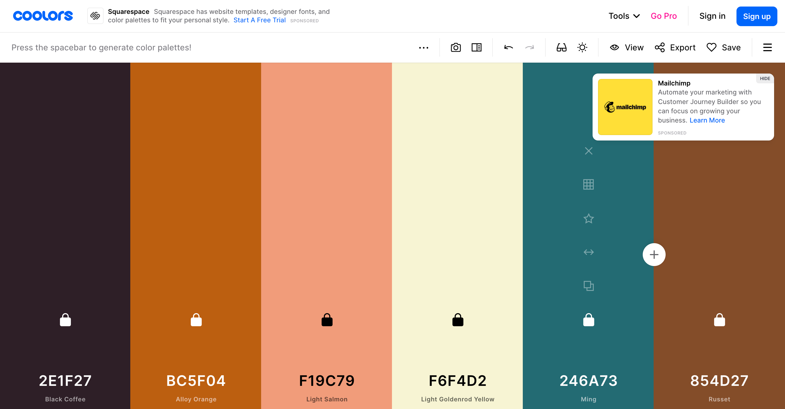

# Honeycomb
(Developer: Lateefat Babalola)

<!--mock up image here-->

[Live website](https://zee-37.github.io/CI_PP1_Honeycomb/)

## Table Of Content

1. [Project Goals](#project-goals)
    1. [User Goals](#user-goals)
    2. [Site Owner Goals](#site-owner-goals)
2. [User Experience](#user-experience)
    1. [Target Audience](#target-audience)
    2. [User Requrements and Expectations](#user-requirements-and-expectations)
    3. [User Stories](#user-stories)
3. [Design](#design)
    1. [Design Choices](#design-choices)
    2. [Colour](#colours)
    3. [Fonts](#fonts)
    4. [Structure](#structure)
    5. [Wireframes](#wireframes)
4. [Technologies Used](#technologies-used)
    1. [Languages](#languages)
    2. [Frameworks & Tools](#frameworks-&-tools)
5. [Features](#features)

## Project Goals

### User goals
- Finding a cafe/wine bar with an eccentric atmosphere, an affordable menu, venue-for-hire
- To find relevant information about cafe such as location, opening times and pricing
- Enquire about venue for hire
- To gain a visual experience of the cafe and see customer’s reviews.

### Site owner goals
- To promote the cafe
- To gain more customers and clients through venue for hire.
- To provide essential information about the cafe to customers
- To introduce new menu
- To allow customers to be able to contact cafe via social media or email

## User experience 

### Target audience
- Locals looking for space to hire
- Couples or groups looking for a nice spot to hang during the day or drink at night
- People who like working at cafe
- Coffee lovers

### User requirements and expectations
- Visually appealing design on all screens
- Accessibility
- Content that is simple and easy to follow
- Functional links and intuitive navigation system
- Clear and easy to find menu

### User stories

#### First-time users
- I want to know the price on the menu
- I want to know where the menu is located
- I want to be able to visualise what it would be like to visit the cafe
- I want to know about previous customers’ experiences.

#### Returning users
- I want to find the business on social media
- I want to leave a review 
- I want to find a phone number for reservations
- I want to hire the venue
- I want to see the menu
- I want to know more about the cafe
- I want to see opening and closing times

#### Site owner
- I want users to see opening and closing times
- I want users to be able to contact us
- I want users to know about our extended hours
- I want users to be able to enquire about venue bookings

## Design

### Design Choices
The website was designed to have a uniform yet playful feel, with warm and rich block colours and accent colours dotted all over the web pages. This was done to portray the atmosphere that the user can expect when visiting the cafe.

### Colour Scheme
To choose a colour scheme, I used a coolors to generate a palette
<!--Insert doc of color scheme screenshots-->

### Fonts
I mostly used sans-serif font-families.

### Structure
The website consists of five separate pages: 
- A homepage with a brief introduction section and two columned section of news about the cafe.
- An about page with customer reviews and a section about the owners.
- A menu page
- A gallery with images showcasing the atmosphere of the cafe
- A contact page with general information such as opening times and contact details; a contact form for enquiries; and an embedded map

### Wireframes

Home

About

Menu

Gallery

Contact

404

## Technologies Used

### Languages
- HTML
- CSS

### Frameworks & Tools
- Balsamiq
- Github
- GitPod
- VSCode
- Bootsrap v5.1
- Coolors
- Font Awesome
- Favicon

## Features

## Testing

## Bugs

## Deployment

## Credits
Images not referenced below are owned by the developer. 

### Media

In order of appearance:
- [img1](assets/images/img1.jpg): Photo by <a href="https://unsplash.com/photos/IkOXmuqeOZo">Abdalla M</a> on <a href="https://unsplash.com/">Unsplash</a>
- [img2](assets/images/img2.jpg): Photo by <a href="https://unsplash.com/photos/pe5D2RleK6E">Kike Salazar N</a> on <a href="https://unsplash.com/">Unsplash</a>
- [img3](assets/images/img3.jpg): Photo by <a href="https://unsplash.com/photos/21tOEaJPM_o">Sung Jin Cho</a> on <a href="https://unsplash.com/">Unsplash</a>
- [a-img1](assets/images/a-img1.jpg): Photo by <a href="https://unsplash.com/photos/_qADvinJi20">John Arano</a> on <a href="https://unsplash.com/">Unsplash</a>
- [a-img2](assets/images/a-img2.jpg): Photo by <a href="https://unsplash.com/photos/23KdVfc395A">Thought Catalog</a> on <a href="https://unsplash.com/">Unsplash</a>
- [g-img1](assets/images/g-img1.jpg): Photo by <a href="https://unsplash.com/photos/71u2fOofI-U">
Nathan Dumlao</a> on <a href="https://unsplash.com/">Unsplash</a>
- [g-img2](assets/images/g-img2.jpg): Photo by <a href="https://unsplash.com/photos/aEiCpMq9fxU">
Nick Fewings</a> on <a href="https://unsplash.com/">Unsplash</a>
- [g-img3](assets/images/g-img3.jpg): Photo by <a href="https://unsplash.com/photos/pnkJ_5PDmKI">
Kwon Junho</a> on <a href="https://unsplash.com/">Unsplash</a>
- [g-img4](assets/images/g-img4.jpg): Photo by <a href="https://unsplash.com/photos/wm0BNnUfXmU">
Kwon Junho</a> on <a href="https://unsplash.com/">Unsplash</a>
- [g-img5](assets/images/g-img5.jpg): Photo by <a href="https://unsplash.com/photos/XPxWx8-Q49U">
Alejandro Sotillet</a> on <a href="https://unsplash.com/">Unsplash</a>
- [g-img6](assets/images/g-img6.jpg): Photo by <a href="https://unsplash.com/photos/cUFli52JBoo">
Walter Lee Olivares de la Cruz</a> on <a href="https://unsplash.com/">Unsplash</a>
- [g-img7](assets/images/g-img7.jpg): Photo by <a href="https://unsplash.com/photos/XdgC1Qo9uVc">
Kwon Junho</a> on <a href="https://unsplash.com/">Unsplash</a>
- [g-img8](assets/images/g-img8.jpg): Photo by <a href="https://unsplash.com/photos/lRc-HSvFqbY">
Kwon Junho</a> on <a href="https://unsplash.com/">Unsplash</a>
- [g-img9](assets/images/g-img9.jpg): Photo by <a href="https://unsplash.com/photos/nuyCCp8jleU">
Brooke Cagle</a> on <a href="https://unsplash.com/">Unsplash</a>
- [g-img10](assets/images/g-img10.jpg): Photo by <a href="https://unsplash.com/photos/4xWsYn3XtvQ">
Maria Avdeeva</a> on <a href="https://unsplash.com/">Unsplash</a>
- [g-img11](assets/images/g-img11.jpg): Photo by <a href="https://unsplash.com/photos/OxKFC5u0980">
Sérgio Alves Santos</a> on <a href="https://unsplash.com/">Unsplash</a>
- [g-img12](assets/images/g-img12.jpg): Photo by <a href="https://unsplash.com/photos/jODz47eM1w8">
frank mckenna</a> on <a href="https://unsplash.com/">Unsplash</a>
- [g-img13](assets/images/g-img13.jpg): Photo by <a href="https://unsplash.com/photos/wiOEVPVRfW4">
GC Libraries Creative Tech Lab</a> on <a href="https://unsplash.com/">Unsplash</a>
- [c-img1](assets/images/c-img1.jpg): Photo by <a href="https://unsplash.com/photos/2AerW-ZnWCI">
Hatfields London</a> on <a href="https://unsplash.com/">Unsplash</a>

## Acknowledgements
